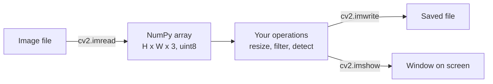
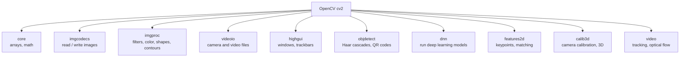
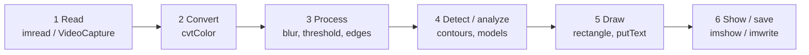

# Computer Vision · 1. OpenCV

> Roadmap status: Learn ☐ Project ☐ Revision ☐
> **Prerequisites:** Python basics, NumPy arrays (Data Analysis section)
> **Interactive version:** open `01_opencv.html` in your browser for live visuals.

## 1. What is it?
**OpenCV** (Open Source Computer Vision Library) is the most widely used open-source library for **image and video processing and classic computer vision**. The core is written in C++ for speed, with bindings for Python, Java and others. In Python you use it through the `cv2` module.

What you can do with it: read and save images and video, resize, crop, filter, detect edges, find contours, track motion, detect faces, calibrate cameras, and even run deep-learning models.

## 2. The big idea: an image is a NumPy array
A digital image is a grid of numbers called **pixels**.

```
Grayscale image (H × W)            Color image (H × W × 3)
┌────────────────────────┐          each pixel = [Blue, Green, Red]
│ 12  40 200 255  90  30 │          values 0–255 (uint8)
│ 15  60 220 250 100  25 │
│ 10  55 210 245  95  20 │          img.shape → (height, width, 3)
└────────────────────────┘          img[y, x] → the pixel at row y, column x
```



### Three facts that trip up every beginner
1. **OpenCV uses BGR order, not RGB.** `img[y, x]` gives `[Blue, Green, Red]`. Libraries like Matplotlib expect RGB, so convert before showing.
2. **Indexing is `[row, column]` = `[y, x]`**, but functions like `cv2.resize` and drawing functions take `(x, y)` or `(width, height)`.
3. **`cv2.imread` returns `None` if the path is wrong.** It does not raise an error, so always check.

## 3. Install
```bash
pip install opencv-python            # standard (includes GUI windows)
pip install opencv-python-headless   # for servers, Docker, Colab (no GUI)
```

## 4. Module map (what's inside)


## 4b. Typical workflow


## 5. Essential code
### Read, inspect, show, save
```python
import cv2

img = cv2.imread("photo.jpg")            # BGR array, or None if the path is wrong
if img is None:
    raise FileNotFoundError("Check the image path")

print(img.shape, img.dtype)              # (height, width, 3) uint8
gray = cv2.cvtColor(img, cv2.COLOR_BGR2GRAY)
small = cv2.resize(img, (320, 240))      # NOTE: (width, height)

cv2.imshow("Photo", small)
cv2.waitKey(0)                           # wait for a key press
cv2.destroyAllWindows()
cv2.imwrite("gray.png", gray)
```

### Draw on an image
```python
cv2.rectangle(img, (50, 50), (200, 150), (0, 255, 0), 2)     # green box, 2 px
cv2.circle(img, (120, 100), 30, (0, 0, 255), -1)             # filled red circle
cv2.putText(img, "Hello", (50, 40), cv2.FONT_HERSHEY_SIMPLEX, 1, (255, 0, 0), 2)
```
Colors are **(B, G, R)**: `(0, 255, 0)` is green, `(0, 0, 255)` is red.

### Webcam / video loop
```python
cap = cv2.VideoCapture(0)                # 0 = default camera, or a video file path
while True:
    ok, frame = cap.read()
    if not ok:
        break
    cv2.imshow("Live", frame)
    if cv2.waitKey(1) & 0xFF == ord("q"):   # press q to quit
        break
cap.release()
cv2.destroyAllWindows()
```

### Show correctly in Matplotlib / Jupyter / Colab
```python
import matplotlib.pyplot as plt
plt.imshow(cv2.cvtColor(img, cv2.COLOR_BGR2RGB))   # convert BGR → RGB first
plt.axis("off"); plt.show()
```

## 6. Cheat sheet
| Task | Function |
|---|---|
| Read / write image | `cv2.imread`, `cv2.imwrite` |
| Show image | `cv2.imshow`, `cv2.waitKey` |
| Resize / crop | `cv2.resize`, array slicing `img[y1:y2, x1:x2]` |
| Color conversion | `cv2.cvtColor(img, cv2.COLOR_BGR2GRAY / RGB / HSV)` |
| Blur | `cv2.GaussianBlur`, `cv2.medianBlur` |
| Edges | `cv2.Canny` |
| Threshold | `cv2.threshold`, `cv2.adaptiveThreshold` |
| Contours | `cv2.findContours`, `cv2.drawContours` |
| Draw | `cv2.line`, `rectangle`, `circle`, `putText` |
| Video | `cv2.VideoCapture`, `cv2.VideoWriter` |
| Run a neural network | `cv2.dnn.readNet`, `cv2.dnn.blobFromImage` |
| Split / merge channels | `cv2.split`, `cv2.merge` |

## 7. Where OpenCV fits next to deep learning

OpenCV handles the **plumbing** around a model (input, preprocessing, drawing) and can also run models itself through the `dnn` module.

## 8. Common mistakes
- Treating the array as RGB (colors look swapped: blue faces).
- Passing `(height, width)` to `cv2.resize`. It wants `(width, height)`.
- Not checking `imread` for `None`.
- Forgetting `cv2.waitKey()`, so the window never appears or instantly closes.
- Using `cv2.imshow` on servers, Docker or Colab (use `opencv-python-headless` and Matplotlib instead).
- Changing the original image when you meant to copy it (use `img.copy()`).

## 9. Interview questions
1. What is OpenCV and what is it used for?
2. How is an image represented in memory? What is its shape for a color image?
3. Why does OpenCV use BGR, and how do you convert to RGB?
4. Difference between `imread` flags for color, grayscale and unchanged?
5. What does `cv2.waitKey(1)` do in a video loop?
6. How do you crop a region of an image?
7. OpenCV vs a deep-learning framework like PyTorch: what does each do?

## 10. Checklist for this topic
- [ ] **Learn**: arrays and shapes, BGR, drawing, video capture, cheat sheet functions
- [ ] **Project**: a webcam app that shows live video, converts to grayscale on a key press and saves snapshots
- [ ] **Project (extra)**: write a script that batch-resizes a folder of images and adds a text label
- [ ] **Revision**: answer the 7 interview questions without notes

## 11. Resources
- Official OpenCV-Python tutorials: https://docs.opencv.org/4.x/d6/d00/tutorial_py_root.html
- OpenCV source and sample images: https://github.com/opencv/opencv (sample images in `samples/data`)
- Community tutorial collection: https://github.com/Blessing988/opencv-python-tutorials
