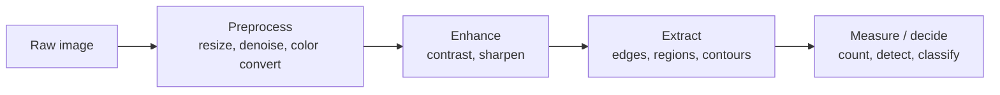
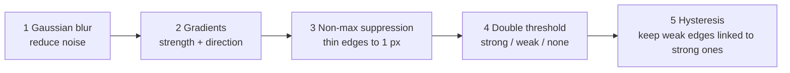

# Computer Vision · 2. Image Processing

> Roadmap status: Learn ☐ Project ☐ Revision ☐
> **Prerequisites:** 01_opencv.md (images as arrays, BGR)
> **Interactive version:** open `02_image_processing.html`. It has a live filter lab you can try on a sample image.

## 1. What is it?
**Image processing** means transforming an image (a grid of numbers) to **enhance it, clean it, or extract useful information** from it. It is the foundation under every computer vision system, including object detection.



## 2. Pixels and color spaces
- **Grayscale:** one number per pixel, 0 (black) to 255 (white).
- **Color:** three numbers per pixel (OpenCV order **B, G, R**).
- **Grayscale conversion** weights channels by how the eye sees brightness: `Y = 0.299 R + 0.587 G + 0.114 B`.

| Color space | Channels | Best for |
|---|---|---|
| **BGR / RGB** | Blue, Green, Red | Display, storage |
| **Grayscale** | Brightness | Edges, thresholding, speed |
| **HSV** | Hue, Saturation, Value | **Color-based detection**: separates the color (hue) from brightness |
| **Lab** | Lightness + 2 color axes | Perceptual color differences |

## 3. Point operations (change each pixel on its own)
```
g(x, y) = α · f(x, y) + β          α = contrast (gain),  β = brightness (bias)
```
Results are **clipped** to 0–255. Use `cv2.convertScaleAbs(img, alpha=1.2, beta=30)`.

- **Invert:** `255 - pixel`
- **Threshold:** pixel above T becomes 255, else 0 → a black and white image

### Thresholding
| Type | Idea | OpenCV |
|---|---|---|
| **Global** | One T for the whole image | `cv2.threshold(gray, 127, 255, cv2.THRESH_BINARY)` |
| **Otsu** | Picks the best T automatically from the histogram | `cv2.THRESH_BINARY + cv2.THRESH_OTSU` |
| **Adaptive** | T depends on the local neighborhood (uneven lighting) | `cv2.adaptiveThreshold(...)` |

## 4. Histograms
A **histogram** counts how many pixels have each brightness value.

```
count
  │      ██
  │    ████          dark image → bars bunched on the left
  │  ██████          bright image → bars bunched on the right
  └────────────► 0 ... 255   low contrast → narrow bunch in the middle
```
- **Histogram equalization** (`cv2.equalizeHist`) spreads brightness values to boost contrast.
- **CLAHE** (`cv2.createCLAHE`) does it locally, which avoids over-brightening.

## 5. Filtering and convolution
A **kernel** (small matrix, e.g. 3×3) slides over the image. At each position, multiply the kernel with the pixels under it and sum the result.


### Common kernels
```
Box blur (1/9)      Gaussian blur (1/16)   Sharpen            Sobel X (vertical edges)
1 1 1               1 2 1                   0 -1  0            -1 0 1
1 1 1               2 4 2                  -1  5 -1            -2 0 2
1 1 1               1 2 1                   0 -1  0            -1 0 1
```
| Filter | Purpose | OpenCV |
|---|---|---|
| Box / average | Simple blur | `cv2.blur` |
| **Gaussian** | Smooth, reduce noise (weights fall off with distance) | `cv2.GaussianBlur` |
| **Median** | Remove salt-and-pepper noise, keeps edges | `cv2.medianBlur` |
| **Bilateral** | Blur but preserve edges | `cv2.bilateralFilter` |
| Sharpen | Boost detail | `cv2.filter2D` with a sharpen kernel |

## 6. Edge detection
Edges are where brightness changes quickly. They are found with **gradients**.

- **Sobel:** gradient in x and y; magnitude = √(Gx² + Gy²). `cv2.Sobel`
- **Laplacian:** second derivative, highlights rapid change. `cv2.Laplacian`
- **Canny** (the standard) `cv2.Canny(gray, 100, 200)`:



## 7. Morphological operations (on binary images)
A **structuring element** (kernel) probes the shape.

| Operation | Effect | Use |
|---|---|---|
| **Erosion** | Shrinks white regions | Remove small white noise |
| **Dilation** | Grows white regions | Fill gaps and holes |
| **Opening** (erode → dilate) | Removes small specks | Clean background noise |
| **Closing** (dilate → erode) | Fills small holes | Close gaps in objects |
| **Gradient** (dilate − erode) | Outline | Object boundary |

```
Original     Erosion     Dilation
. # # # .    . . # . .    # # # # #
. # # # .    . . # . .    # # # # #
. . # . .    . . . . .    # # # # #
```
Code: `cv2.erode`, `cv2.dilate`, `cv2.morphologyEx(img, cv2.MORPH_OPEN, kernel)`.

## 8. Contours
A **contour** is a curve joining the boundary points of a shape. Typical pipeline:


## 9. Geometric transformations
| Transform | Meaning | OpenCV |
|---|---|---|
| Resize | Change size | `cv2.resize` |
| Rotate / scale | Around a point | `cv2.getRotationMatrix2D` + `cv2.warpAffine` |
| Affine | Keeps parallel lines | `cv2.warpAffine` |
| Perspective | Fixes viewing angle (document scanner) | `cv2.getPerspectiveTransform` + `cv2.warpPerspective` |
| Flip / crop | Mirror, region | `cv2.flip`, slicing |

Image **pyramids** (`cv2.pyrDown`, `cv2.pyrUp`) make multi-scale versions of an image, which later helps detect objects of different sizes.

## 10. Hands-on code
```python
import cv2, numpy as np

img  = cv2.imread("photo.jpg")
gray = cv2.cvtColor(img, cv2.COLOR_BGR2GRAY)

blur  = cv2.GaussianBlur(gray, (5, 5), 0)
edges = cv2.Canny(blur, 100, 200)
_, mask = cv2.threshold(blur, 0, 255, cv2.THRESH_BINARY + cv2.THRESH_OTSU)

kernel = np.ones((3, 3), np.uint8)
clean  = cv2.morphologyEx(mask, cv2.MORPH_OPEN, kernel)

contours, _ = cv2.findContours(clean, cv2.RETR_EXTERNAL, cv2.CHAIN_APPROX_SIMPLE)
for c in contours:
    if cv2.contourArea(c) > 500:                       # ignore tiny noise
        x, y, w, h = cv2.boundingRect(c)
        cv2.rectangle(img, (x, y), (x + w, y + h), (0, 255, 0), 2)

cv2.imwrite("result.png", img)
```

### Color-based detection with HSV
```python
hsv = cv2.cvtColor(img, cv2.COLOR_BGR2HSV)
mask = cv2.inRange(hsv, (100, 120, 70), (130, 255, 255))   # a blue range (tune for your image)
only_blue = cv2.bitwise_and(img, img, mask=mask)
```

## 11. Common mistakes
- Skipping the blur before Canny or thresholding, so noise creates false edges.
- Using one global threshold on unevenly lit images (use adaptive or Otsu).
- Applying morphology to grayscale when you meant a binary mask.
- Forgetting results are clipped to 0–255 or that `uint8` can overflow when you add arrays manually (use `cv2.add`).
- Using even-sized kernels. Blur kernels must be odd (3, 5, 7).

## 12. Interview questions
1. What is convolution in image processing? Walk through one step.
2. Gaussian vs median filter: when do you use each?
3. Explain the stages of the Canny edge detector.
4. What is Otsu's method?
5. Erosion vs dilation vs opening vs closing?
6. What does histogram equalization do?
7. Why use HSV instead of BGR for color detection?
8. How would you detect and count objects on a plain background using contours?

## 13. Checklist for this topic
- [ ] **Learn**: color spaces, thresholding, convolution and kernels, Canny, morphology, contours
- [ ] **Project**: a document scanner (edges → contours → perspective transform)
- [ ] **Project (extra)**: count coins or objects on a plain background using threshold + morphology + contours
- [ ] **Revision**: answer the 8 interview questions; recompute one 3×3 convolution by hand

## 14. Resources
- OpenCV-Python tutorials (thresholding, gradients, histograms, contours): https://docs.opencv.org/4.x/d6/d00/tutorial_py_root.html
- Sample images to practice on: https://github.com/opencv/opencv/tree/master/samples/data
