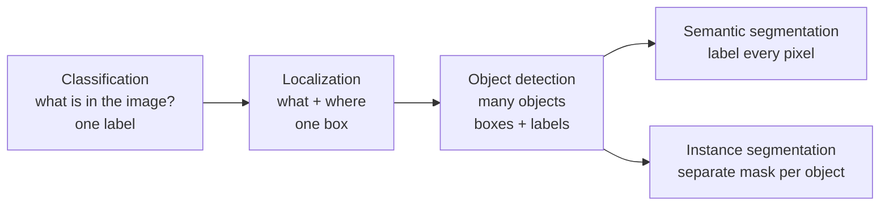
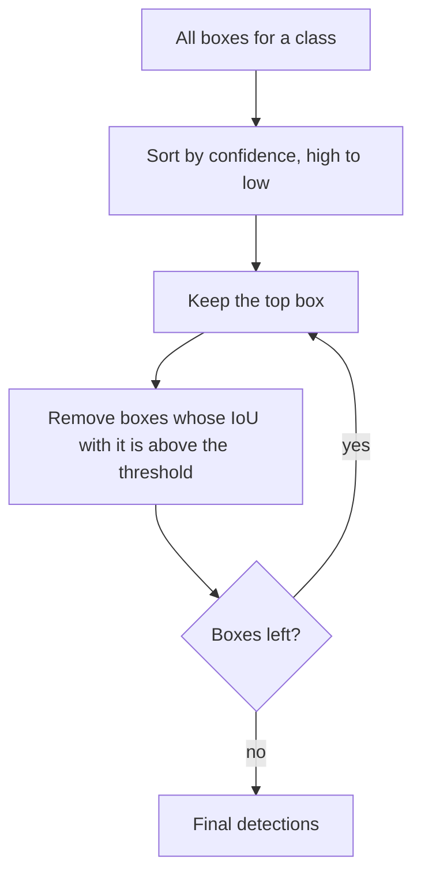
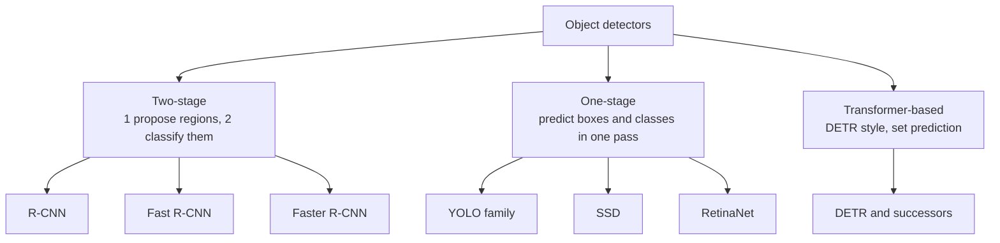
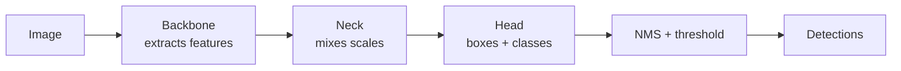

# Computer Vision · 3. Object Detection

> Roadmap status: Learn ☐ Project ☐ Revision ☐
> **Prerequisites:** 01_opencv.md, 02_image_processing.md, basic CNNs (Deep Learning section)
> **Interactive version:** open `03_object_detection.html` for live IoU and NMS demos.

## 1. What is it?
**Object detection** finds **what** objects are in an image **and where** they are. For each object it outputs a **bounding box**, a **class label** and a **confidence score**.

```
Input image  →  Detector  →  [ (box 1, "person", 0.94), (box 2, "dog", 0.88), ... ]
```

## 2. How it differs from related tasks


## 3. Key concepts
### Bounding box formats
| Format | Values | Used by |
|---|---|---|
| `xyxy` | x_min, y_min, x_max, y_max | Many libraries and drawing code |
| `xywh` | x_min, y_min, width, height | COCO annotations |
| **YOLO normalized** | class, x_center, y_center, width, height, all divided by image size (0 to 1) | YOLO label files |

### IoU (Intersection over Union)
How much two boxes overlap.
```
IoU = area of overlap / area of union
```
```
 ┌───────┐
 │   A   │
 │   ┌───┼───┐        Example: A = (0,0)-(10,10), B = (5,5)-(15,15)
 └───┼───┘   │        overlap = 5 × 5 = 25
     │   B   │        union   = 100 + 100 − 25 = 175
     └───────┘        IoU = 25 / 175 ≈ 0.14  → poor match
```
IoU 1.0 = perfect overlap, 0 = none. A prediction is usually called **correct** when IoU with a ground-truth box is ≥ 0.5 (a common threshold) and the class is right.

### Confidence score
How sure the model is that a box contains an object of that class. You keep boxes above a **confidence threshold** (e.g. 0.25).

### NMS (Non-Maximum Suppression)
Detectors output many overlapping boxes for the same object. NMS keeps the best one.


### Anchors
Preset box shapes (sizes and aspect ratios) the model adjusts. Many older detectors use them. Newer **anchor-free** designs predict boxes directly.

## 4. Detector families

| Family | Strength | Weakness |
|---|---|---|
| **Two-stage** (Faster R-CNN) | Strong accuracy, especially on small or tough objects | Slower |
| **One-stage** (YOLO, SSD) | **Fast**, good for real-time and edge devices | Historically a bit less accurate (the gap is small today) |
| **Transformer** (DETR) | No NMS or anchors needed in the original design, clean pipeline | Heavier training, slower to converge |

### Speed vs accuracy (conceptual)
```
accuracy ▲
         │   Faster R-CNN ●
         │                     ● big modern detectors
         │         ● SSD
         │              ● YOLO (n/s/m/l/x sizes slide along this curve)
         └──────────────────────────► speed (FPS)
```
Pick by need: real-time on a Raspberry Pi → a **small (nano) YOLO**; best accuracy offline → a bigger model.

## 5. How YOLO thinks (one-stage idea)
"You Only Look Once": the image goes through the network **once**.
```
┌─┬─┬─┬─┬─┬─┬─┐
├─┼─┼─┼─┼─┼─┤ │    Split the image into a grid. The cell holding an object's center
├─┼─┼─●─┼─┼─┤ │    predicts: box (x, y, w, h) + confidence + class probabilities.
├─┼─┼─┼─┼─┼─┤ │    All cells predict at once → fast.
└─┴─┴─┴─┴─┴─┴─┘    NMS then removes duplicates.
```

### Pipeline inside a modern detector


## 6. Evaluation metrics
| Metric | Meaning |
|---|---|
| **Precision** | Of the boxes the model predicted, how many were right? `TP / (TP + FP)` |
| **Recall** | Of the real objects, how many did it find? `TP / (TP + FN)` |
| **AP (Average Precision)** | Area under the precision-recall curve for one class |
| **mAP** | AP averaged over all classes |
| **mAP@0.5** | mAP using IoU threshold 0.5 |
| **mAP@0.5:0.95** | mAP averaged over IoU thresholds 0.5 to 0.95 (the COCO standard, stricter) |
| **FPS / latency** | Speed |

`TP` = correct detection, `FP` = false alarm, `FN` = missed object.

## 7. Datasets
| Dataset | Notes |
|---|---|
| **COCO** | 80 object classes, the standard benchmark, with boxes and segmentation |
| **Pascal VOC** | 20 classes, smaller and classic |
| **Open Images** | Very large, many classes |
| **Your own data** | Label with a tool (e.g. Roboflow, CVAT, Label Studio) and export in YOLO format |

## 8. Hands-on code
### Detect with a pretrained YOLO (Ultralytics)
```python
# pip install ultralytics
from ultralytics import YOLO

model = YOLO("yolov8n.pt")            # small pretrained model; swap in the latest name from the docs
results = model("street.jpg")          # run detection

for r in results:
    for box in r.boxes:
        cls = int(box.cls[0])
        print(model.names[cls], float(box.conf[0]), box.xyxy[0].tolist())

results[0].save("detected.jpg")        # image with boxes drawn
```

### Webcam detection with OpenCV + YOLO
```python
import cv2
from ultralytics import YOLO

model = YOLO("yolov8n.pt")
cap = cv2.VideoCapture(0)
while True:
    ok, frame = cap.read()
    if not ok: break
    annotated = model(frame, verbose=False)[0].plot()     # draws boxes on a BGR image
    cv2.imshow("Detection", annotated)
    if cv2.waitKey(1) & 0xFF == ord("q"): break
cap.release(); cv2.destroyAllWindows()
```

### Train on your own dataset
```bash
yolo detect train data=data.yaml model=yolov8n.pt epochs=50 imgsz=640
```
`data.yaml` lists your image folders and class names. Label files are one `.txt` per image with lines `class x_center y_center width height` (normalized).

### IoU from scratch
```python
def iou(a, b):                          # boxes as (x1, y1, x2, y2)
    x1, y1 = max(a[0], b[0]), max(a[1], b[1])
    x2, y2 = min(a[2], b[2]), min(a[3], b[3])
    inter = max(0, x2 - x1) * max(0, y2 - y1)
    union = (a[2]-a[0])*(a[3]-a[1]) + (b[2]-b[0])*(b[3]-b[1]) - inter
    return inter / union if union else 0

print(iou((0, 0, 10, 10), (5, 5, 15, 15)))   # ≈ 0.143
```

## 9. Running on small devices (edge)
- Choose a **nano/small** model and a smaller input size (e.g. 320 instead of 640).
- Export to an efficient format (ONNX, NCNN, TFLite) and use quantization (see LLM file 09 for the idea).
- Measure real FPS on the device, not only on your laptop.

## 10. Common mistakes
- Mixing up box formats (`xyxy` vs `xywh` vs normalized), which gives boxes in the wrong place.
- Judging a model only by mAP@0.5 and ignoring the stricter mAP@0.5:0.95.
- Setting the confidence threshold too low (many false boxes) or too high (missed objects).
- Training with poorly labeled or too few images, or with a different class balance than real use.
- Testing on the same images used for training.
- Forgetting that OpenCV frames are BGR when passing images to other tools.

## 11. Interview questions
1. What is object detection and how is it different from classification and segmentation?
2. Define IoU and compute it for two boxes.
3. What is NMS and why is it needed?
4. Two-stage vs one-stage detectors: trade-offs?
5. What are anchor boxes? What does anchor-free mean?
6. Explain precision, recall, AP and mAP.
7. Why is mAP@0.5:0.95 stricter than mAP@0.5?
8. How would you improve detection of small objects?
9. How would you deploy a detector on a low-power device?

## 12. Checklist for this topic
- [ ] **Learn**: IoU, NMS, confidence, one-stage vs two-stage, mAP, label formats
- [ ] **Project**: run a pretrained YOLO on your own images and on webcam video; note failures
- [ ] **Project (extra)**: train a custom detector on a small dataset (50 to 200 labeled images) and report mAP
- [ ] **Project (extra)**: write IoU and NMS from scratch in NumPy
- [ ] **Revision**: answer the 9 interview questions without notes

## 13. Resources
- Ultralytics COCO dataset page: https://docs.ultralytics.com/datasets/detect/coco
- COCO dataset: https://cocodataset.org
- Ultralytics repository: https://github.com/ultralytics/ultralytics
- FiftyOne object detection guide: https://docs.voxel51.com/getting_started/object_detection/index.html
- Papers: YOLO https://arxiv.org/abs/1506.02640 · Faster R-CNN https://arxiv.org/abs/1506.01497 · SSD https://arxiv.org/abs/1512.02325
