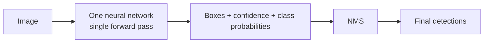
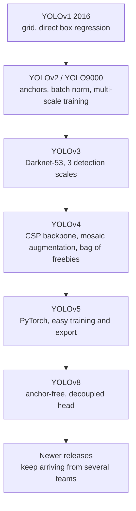
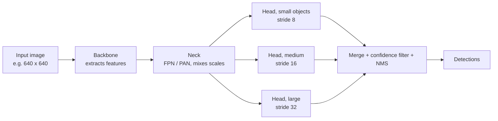

# Computer Vision · 4. YOLO (You Only Look Once)

> Roadmap status: Learn ☐ Project ☐ Revision ☐
> **Prerequisites:** 03_object_detection.md (IoU, NMS, confidence, mAP, anchors)

## 1. What is it?
**YOLO** is a family of **one-stage object detectors** that look at the whole image **once** and directly predict bounding boxes and class labels. It treats detection as a single regression problem, which makes it **very fast**, so it became the default choice for real-time detection on cameras, drones, robots and edge devices.

Original paper: "You Only Look Once: Unified, Real-Time Object Detection" (Redmon et al., 2016).



## 2. The original idea (YOLOv1)
Divide the image into an **S × S grid** (7 × 7 in the paper). The grid cell that contains an object's **center** is responsible for detecting it.

```
┌─┬─┬─┬─┬─┬─┬─┐
├─┼─┼─┼─┼─┼─┤ │   Each cell predicts:
├─┼─┼─●─┼─┼─┤ │    • B boxes, each with  x, y, w, h, confidence
├─┼─┼─┼─┼─┼─┤ │    • C class probabilities (one set per cell)
└─┴─┴─┴─┴─┴─┴─┘
   ● = center of an object → that cell makes the prediction
```

### Output tensor (YOLOv1 on Pascal VOC)
```
S × S × (B·5 + C) = 7 × 7 × (2·5 + 20) = 7 × 7 × 30
```
- `5` per box = x, y, w, h, confidence
- `C = 20` classes in Pascal VOC

### Confidence and class score
```
confidence       = Pr(object) × IoU(pred box, truth box)
class-specific   = Pr(class | object) × confidence
```
Boxes with a low score are dropped, then **NMS** removes duplicates.

### Why it is fast and what it gives up
| Strength | Weakness (v1) |
|---|---|
| One pass, simple pipeline, real-time | Each cell predicts few boxes and one class, so **small objects in groups** (a flock of birds) are hard |
| Sees the whole image, so fewer background mistakes than region-based methods | Localization less precise than two-stage detectors |
| Learns general object features | Struggles with unusual aspect ratios |

The paper reported about **45 FPS** (and a smaller "Fast YOLO" at about 155 FPS) with strong mAP on Pascal VOC for that time.

## 3. How YOLO evolved

| Version | Key change |
|---|---|
| **v2** | Anchor boxes (sizes found with k-means), batch normalization, higher-resolution input |
| **v3** | Predicts at **3 scales** (big, medium, small objects), stronger backbone |
| **v4** | Training tricks (mosaic augmentation, better loss) for accuracy at the same speed |
| **v5** | PyTorch implementation by Ultralytics, easy to train, deploy and export |
| **v8 and later** | **Anchor-free**, **decoupled head** (separate branches for box and class), multiple model sizes |

Note: later "YOLO" versions come from different groups and are not one official lineage, so check each model's source and license (for example, Ultralytics models use their own license terms). Always read the current docs for the newest model names.

## 4. Anatomy of a modern YOLO

- **Backbone:** a CNN that turns the image into feature maps.
- **Neck:** combines features from different depths so small and large objects both work.
- **Head:** predicts box, objectness and class. Modern heads are **anchor-free** and **decoupled**.
- **Strides 8, 16, 32:** each head works on a feature map that is 8×, 16× or 32× smaller than the input, handling small, medium and large objects.

### Anchor-based decoding (YOLOv2 / v3 style)
The network predicts offsets `tx, ty, tw, th` relative to a grid cell and an anchor:
```
bx = σ(tx) + cx           by = σ(ty) + cy          (center, inside cell (cx, cy))
bw = pw · e^(tw)          bh = ph · e^(th)         (size relative to anchor pw × ph)
```
Anchor-free versions predict box distances directly without preset anchor shapes.

## 5. Loss (what the model learns)
```
Total loss = box loss  +  objectness loss  +  class loss
```
- **Box loss:** how far the predicted box is from the truth (YOLOv1 used squared error with extra weight on coordinates; later versions use IoU-based losses such as CIoU).
- **Objectness loss:** is there an object here?
- **Class loss:** which class?

## 6. Model sizes and the speed-accuracy dial
Modern releases come in sizes such as **n (nano), s, m, l, x**.
```
 accuracy ▲                      x ●
          │                 l ●
          │            m ●
          │       s ●
          │  n ●
          └────────────────────────► speed
```
Pick **n or s** for Raspberry Pi, phones and real-time video; **l or x** when accuracy matters more than speed.

## 7. Label format and dataset layout
One `.txt` per image, one line per object, all values **normalized** (0 to 1):
```
class_id  x_center  y_center  width  height
0         0.512     0.430     0.210  0.380
```
```
dataset/
├── images/train/  images/val/
├── labels/train/  labels/val/
└── data.yaml        # paths + class names
```
```yaml
# data.yaml
path: dataset
train: images/train
val: images/val
names:
  0: person
  1: helmet
```

## 8. Hands-on code (Ultralytics)
```bash
pip install ultralytics
```
### Inference
```python
from ultralytics import YOLO

model = YOLO("yolov8n.pt")            # pretrained nano model (swap for the newest name in the docs)
results = model("street.jpg", conf=0.25, iou=0.5)   # confidence and NMS IoU thresholds

for r in results:
    for b in r.boxes:
        print(model.names[int(b.cls[0])], round(float(b.conf[0]), 2), b.xyxy[0].tolist())
results[0].save("out.jpg")
```
### Train, validate, export, track
```python
model = YOLO("yolov8n.pt")
model.train(data="data.yaml", epochs=50, imgsz=640)     # fine-tune on your data
metrics = model.val()                                    # mAP, precision, recall
model.export(format="onnx")                              # for deployment (also other formats)

for r in model.track(source=0, stream=True, persist=True):   # webcam with object tracking IDs
    pass
```
### Key settings to know
| Setting | Effect |
|---|---|
| `conf` | Minimum confidence to keep a box. Lower = more detections and more false ones |
| `iou` | NMS overlap threshold. Lower = removes more overlapping boxes |
| `imgsz` | Input size. Larger helps small objects but is slower |
| `epochs`, `batch` | Training length and batch size |

## 9. Tips for good results
- **Data quality beats model size:** consistent labels, varied lighting, angles and backgrounds.
- Include **background images** (no objects) to cut false positives.
- Start from **pretrained weights** and fine-tune.
- Check the **confusion matrix** and failure cases, not only mAP.
- For small objects, raise `imgsz` or use tiling.
- For edge devices, test export formats and measure real FPS on the device.

## 10. Common mistakes
- Wrong label format (pixel values instead of normalized, or `xyxy` instead of center-based).
- Class IDs in labels not matching `data.yaml`.
- Evaluating on images the model trained on.
- Setting `conf` too low or too high without looking at results.
- Assuming one YOLO version is "best" without testing on your own data.
- Ignoring the model license when using it commercially.

## 11. Interview questions
1. Why is YOLO called "one-stage" and why is it fast?
2. Explain the YOLOv1 grid and the 7 × 7 × 30 output.
3. What is the confidence score made of?
4. What changed in YOLOv2 and v3 (anchors, multi-scale)?
5. Anchor-based vs anchor-free detection?
6. What is a decoupled head?
7. Why do modern YOLOs detect at three strides?
8. How would you deploy YOLO on a Raspberry Pi or phone?
9. How does `conf` and NMS `iou` change the results?

## 12. Checklist for this topic
- [ ] **Learn**: grid idea, output tensor, confidence, evolution, backbone-neck-head, label format
- [ ] **Project**: train a custom YOLO detector on 100+ labeled images of your own and report mAP
- [ ] **Project (extra)**: compare n vs s vs m model sizes: FPS vs mAP table
- [ ] **Project (extra)**: export to ONNX and run it with OpenCV `dnn`
- [ ] **Revision**: answer the 9 interview questions without notes

## 13. Resources
- Paper: YOLO https://arxiv.org/abs/1506.02640
- Ultralytics repository: https://github.com/ultralytics/ultralytics
- Ultralytics COCO dataset page: https://docs.ultralytics.com/datasets/detect/coco
- COCO dataset: https://cocodataset.org
