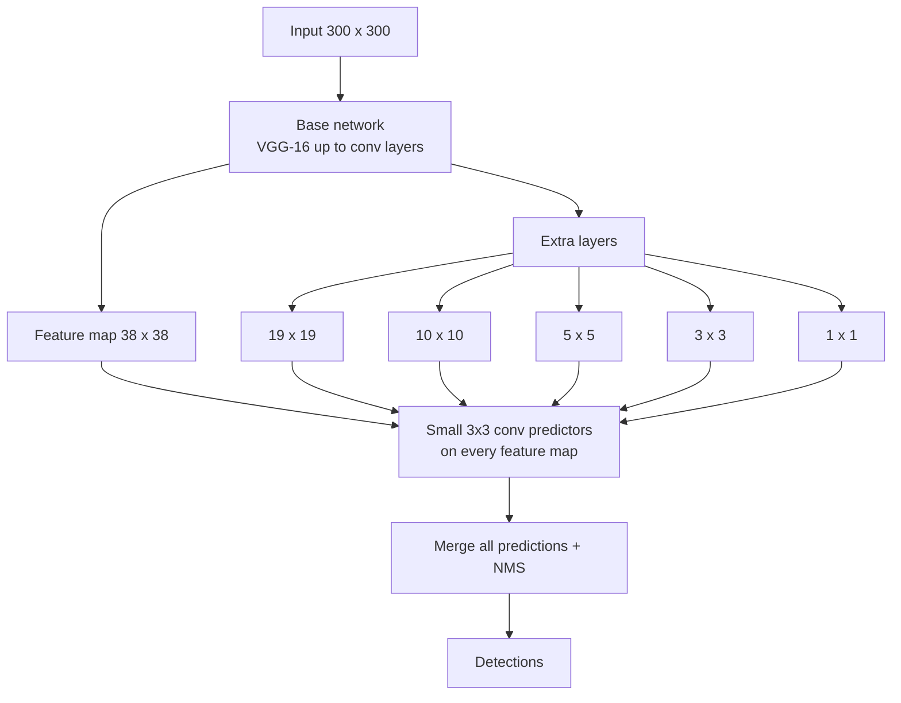
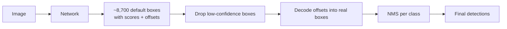

# Computer Vision · 5. SSD (Single Shot MultiBox Detector)

> Roadmap status: Learn ☐ Project ☐ Revision ☐
> **Prerequisites:** 03_object_detection.md, 04_yolo.md (one-stage idea, anchors, NMS)

## 1. What is it?
**SSD** is a **one-stage object detector** that predicts boxes and classes in a **single pass**, like YOLO, but with one key difference: it makes predictions from **several feature maps of different sizes**. That multi-scale design lets it detect small and large objects well while staying fast.

Original paper: "SSD: Single Shot MultiBox Detector" (Liu et al., 2016).

- **Single shot:** one network pass, no separate region-proposal step.
- **MultiBox:** it predicts many **default boxes** (anchors) per location.

## 2. The core idea
Early feature maps are large and keep fine detail (good for **small** objects). Deeper feature maps are small and carry strong meaning (good for **large** objects). SSD attaches a detector to **each** of them.

```
Image 300×300
   │
   ▼
[ Base network (VGG-16, truncated) ]──► feature map 38×38 ──► detect SMALL objects
   │
   ▼
[ extra conv layers ]──► 19×19 ──► detect
   │                  ──► 10×10 ──► detect
   │                  ──►  5×5  ──► detect
   │                  ──►  3×3  ──► detect
   │                  ──►  1×1  ──► detect LARGE objects
   ▼
 Combine all predictions → NMS → final detections
```



## 3. Default boxes (anchors)
At every cell of every feature map, SSD places several **default boxes** with different **scales** and **aspect ratios**.

```
One cell of a feature map           Default boxes at that cell
┌───────────┐
│  ┌─────┐  │     aspect ratio 1:1   ▢
│  │     │  │     aspect ratio 2:1   ▭ (wide)
│  └─────┘  │     aspect ratio 1:2   ▯ (tall)
└───────────┘     + more ratios (3, 1/3) on some layers
```
Box scale grows with depth: smaller scale on early maps, larger on deep maps.
```
s_k = s_min + (s_max − s_min)/(m − 1) · (k − 1)       (paper uses s_min = 0.2, s_max = 0.9)
```

For each default box SSD predicts:
- **Class scores** for `C + 1` classes (the extra one is **background**)
- **4 offsets** to adjust the box (center x, y, width, height)

### How many boxes? (SSD300)
| Feature map | Boxes per cell | Total boxes |
|---|---|---|
| 38 × 38 | 4 | 5,776 |
| 19 × 19 | 6 | 2,166 |
| 10 × 10 | 6 | 600 |
| 5 × 5 | 6 | 150 |
| 3 × 3 | 4 | 36 |
| 1 × 1 | 4 | 4 |
| **Total** | | **8,732** |

Most of these are background, which is why SSD needs special handling (see hard negative mining).

## 4. Training: matching and loss
### Matching strategy
Each ground-truth box is matched to default boxes:
1. The default box with the **highest IoU** with a ground truth is a positive.
2. Any default box with **IoU > 0.5** to a ground truth is also a positive.
3. Everything else is **background** (negative).

### Loss
```
L = (1/N) · ( L_conf + α · L_loc )
```
- **L_conf:** softmax classification loss (including background)
- **L_loc:** **Smooth L1** loss on box offsets, only for positive boxes
- **N:** number of matched default boxes, **α:** balance weight

### Hard negative mining
There are far more negatives than positives. SSD keeps only the **hardest negatives** (highest loss), at about a **3 : 1** negative-to-positive ratio, so training stays balanced.

### Data augmentation
Random crops, flips, zoom-in and zoom-out, and color changes helped SSD a lot, especially for small objects.

## 5. Inference


## 6. Results from the paper
On Pascal VOC 2007, **SSD300** reached about **74% mAP at about 59 FPS**, and the larger **SSD512** about 77% mAP. For its time that matched or beat Faster R-CNN's accuracy at a far higher speed. (Numbers are from the original paper, with that hardware and setup.)

## 7. SSD vs YOLO vs Faster R-CNN
| | SSD | YOLO | Faster R-CNN |
|---|---|---|---|
| Type | One-stage | One-stage | Two-stage |
| Multi-scale | **Yes, by design** (multiple feature maps) | Added from v3 onward | Via FPN extension |
| Anchors | Default boxes | Anchors (v2 to v5), anchor-free (v8+) | Anchors in RPN |
| Speed | Fast | Fast | Slower |
| Small objects | Moderate (early maps have weak semantics) | Improved by multi-scale heads | Good with FPN |

## 8. Strengths and weaknesses
| Strengths | Weaknesses |
|---|---|
| Fast and simple, single pass | Small objects can still be hard |
| Multi-scale detection built in | Many default boxes and heavy class imbalance |
| Works well with light backbones for mobile | Sensitive to default box design (scales, ratios) |
| Strong accuracy-speed balance | Needs careful augmentation and hard negative mining |

### Mobile-friendly variants
- **MobileNet-SSD** and **SSDLite** swap the heavy VGG backbone for **MobileNet** and use cheaper layers, so they run on phones and small boards.

## 9. Hands-on code (PyTorch / torchvision)
```python
# pip install torch torchvision
import torch
from torchvision.io import read_image
from torchvision.models.detection import ssdlite320_mobilenet_v3_large, SSDLite320_MobileNet_V3_Large_Weights

weights = SSDLite320_MobileNet_V3_Large_Weights.DEFAULT
model = ssdlite320_mobilenet_v3_large(weights=weights).eval()
preprocess = weights.transforms()

img = read_image("street.jpg")                    # tensor C×H×W
with torch.no_grad():
    out = model([preprocess(img)])[0]             # dict: boxes, labels, scores

keep = out["scores"] > 0.5
names = [weights.meta["categories"][i] for i in out["labels"][keep]]
print(names)
print(out["boxes"][keep])                          # xyxy
```
Torchvision also provides `ssd300_vgg16`, the original-style SSD with a VGG-16 backbone.

### Draw the results with OpenCV
```python
import cv2
im = cv2.imread("street.jpg")
for box, name in zip(out["boxes"][keep].int().tolist(), names):
    x1, y1, x2, y2 = box
    cv2.rectangle(im, (x1, y1), (x2, y2), (0, 255, 0), 2)
    cv2.putText(im, name, (x1, y1 - 6), cv2.FONT_HERSHEY_SIMPLEX, 0.6, (0, 255, 0), 2)
cv2.imwrite("ssd_out.jpg", im)
```
Boxes are scaled to the image the model received, so if the preprocessing resizes the image, scale the boxes back before drawing on the original.

**Try this:** run SSDLite on the same images as a YOLO nano model and compare speed and misses.

## 10. Common mistakes
- Forgetting the **background class** when counting classes (`C + 1`).
- Drawing boxes on the original image without scaling them from the resized input.
- Using too many or too few default box scales for your object sizes.
- Expecting top accuracy on very small objects from the 300 × 300 model.
- Skipping hard negative mining or augmentation when training from scratch.

## 11. Interview questions
1. What does "single shot" mean in SSD?
2. Why does SSD use multiple feature maps?
3. What are default boxes and how are they matched to ground truth?
4. What is hard negative mining and why is it needed?
5. Write the SSD loss and explain each part.
6. Why does SSD use `C + 1` classes?
7. How many default boxes does SSD300 use, and where do they come from?
8. SSD vs YOLO: differences in design?
9. Why is SSD weaker on small objects than on medium ones?

## 12. Checklist for this topic
- [ ] **Learn**: multi-scale feature maps, default boxes, matching, loss, hard negative mining
- [ ] **Project**: run SSDLite and a YOLO nano on 20 images and compare speed, hits and misses
- [ ] **Project (extra)**: recompute the 8,732 default box count by hand and in code
- [ ] **Revision**: answer the 9 interview questions without notes

## 13. Resources
- Paper: SSD https://arxiv.org/abs/1512.02325
- Torchvision detection models (search "torchvision.models.detection" in the PyTorch docs)
- Object detection guide: https://docs.voxel51.com/getting_started/object_detection/index.html
