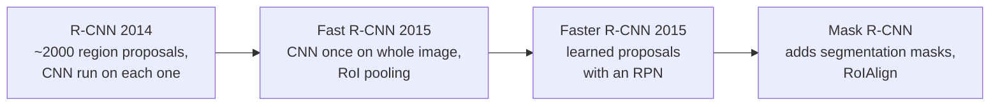
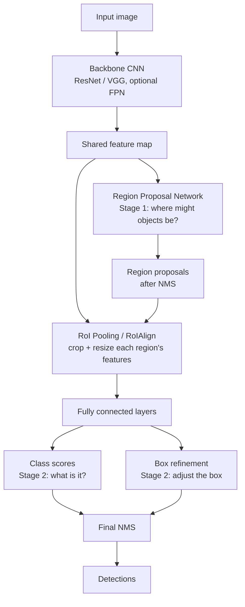

# Computer Vision · 6. Faster R-CNN

> Roadmap status: Learn ☐ Project ☐ Revision ☐
> **Prerequisites:** 03_object_detection.md (IoU, NMS, anchors), CNN basics

## 1. What is it?
**Faster R-CNN** is the classic **two-stage object detector**. It first **proposes regions** that might contain objects, then **classifies and refines** each region. It is known for **high accuracy**, especially on harder or smaller objects, at the cost of speed compared with one-stage detectors like YOLO and SSD.

Original paper: "Faster R-CNN: Towards Real-Time Object Detection with Region Proposal Networks" (Ren et al., 2015).

## 2. The family tree: why "Faster"?

| Model | Region proposals | Main limitation |
|---|---|---|
| **R-CNN** | Selective Search (hand-designed, slow) | CNN run separately on ~2000 regions: very slow |
| **Fast R-CNN** | Selective Search | Shares CNN features, but proposals are still a slow, separate step |
| **Faster R-CNN** | **Region Proposal Network (RPN)**, learned and shares features | Still two stages, slower than one-stage |

## 3. Architecture


### Stage 0: Backbone
A CNN (VGG-16 in the paper, today usually ResNet, often with an **FPN**) converts the image into a feature map. Both stages **share** it, which saves computation.

### Stage 1: Region Proposal Network (RPN)
A small network slides over the feature map. At every position it considers **k anchors** of several **scales** and **aspect ratios**.
```
Paper default: 3 scales × 3 aspect ratios = 9 anchors per position

Each anchor gets:
   • objectness score  → object vs background        (2k outputs)
   • box offsets       → refine the anchor's shape    (4k outputs)
```
```
Feature map position                  Anchors (centered at that position)
┌───┐                                    ▢  small square
│ ● │   →  9 anchors   →                 ▭  wide        (× 3 sizes each)
└───┘                                    ▯  tall
```
After scoring, the RPN keeps the best boxes and applies **NMS** to leave a few hundred to a couple of thousand **proposals**.

**Anchor labels for RPN training**
- **Positive:** IoU > 0.7 with a ground-truth box (or the highest-IoU anchor for that box)
- **Negative:** IoU < 0.3 with all ground-truth boxes
- Anchors in between are ignored

### Stage 2: Detection head
1. **RoI Pooling** (or **RoIAlign**) cuts each proposal out of the shared feature map and resizes it to a fixed size (for example 7 × 7), so every region has the same shape.
2. Fully connected layers process it.
3. Two outputs: **class scores** (including background) and **refined box coordinates**.

```
Proposal (any size)  →  RoIAlign  →  7×7 feature grid  →  FC layers  →  class + refined box
```
**RoIAlign vs RoI Pooling:** RoI Pooling rounds coordinates to whole cells, which causes small misalignments. RoIAlign (introduced with Mask R-CNN) uses interpolation and avoids that, improving precision.

## 4. Loss
Both stages use the same kind of loss:
```
L = L_cls + λ · L_reg
```
- **L_cls:** classification loss (object/background in the RPN; class in the head)
- **L_reg:** **Smooth L1** loss on box offsets, applied only to positive samples

Training the RPN and the detector together is called **joint training**. The original paper also described a 4-step alternating scheme; modern implementations train end to end.

## 5. Feature Pyramid Network (FPN)
Objects come in many sizes. **FPN** builds a pyramid of feature maps with strong meaning at every scale, and assigns each proposal to the level that suits its size.
```
High-res, weak meaning   ─┐
                           ├─ merged top-down ─►  every level: high-res AND strong meaning
Low-res, strong meaning  ─┘
```
`fasterrcnn_resnet50_fpn` (ResNet-50 + FPN) is the common standard setup, and it improves small-object detection a lot.

## 6. Strengths and weaknesses
| Strengths | Weaknesses |
|---|---|
| High accuracy, strong localization | Slower than one-stage detectors |
| Handles small and crowded objects well (especially with FPN) | More complex pipeline with two stages |
| Easy to extend (Mask R-CNN for masks, keypoints) | Heavier memory and compute, harder on small edge devices |
| Good for offline or accuracy-critical analysis | Many hyperparameters (anchors, NMS, proposal counts) |

## 7. Faster R-CNN vs SSD vs YOLO
| | Faster R-CNN | SSD | YOLO |
|---|---|---|---|
| Stages | **Two** | One | One |
| Strength | Accuracy | Speed + multi-scale | Speed, ease of use, tooling |
| Weakness | Speed | Small objects | Older versions weaker on tiny or crowded objects |
| Best for | Accuracy-first, offline, research baselines | Mobile / embedded (with MobileNet) | Real-time video, edge devices, fast iteration |
| Anchors | Yes (RPN) | Yes (default boxes) | Yes (v2 to v5), anchor-free (v8+) |

```
 accuracy ▲
          │  ● Faster R-CNN (+FPN)
          │
          │          ● modern YOLO (m/l/x)
          │      ● SSD
          │              ● YOLO nano/small
          └───────────────────────────────► speed
 (conceptual positions; real results depend on model, size, hardware and dataset)
```
**Rule of thumb:** need real-time or edge → YOLO or SSD-style. Need top accuracy and speed matters less → Faster R-CNN or newer two-stage and transformer detectors.

## 8. Hands-on code (torchvision)
### Inference with a pretrained model
```python
# pip install torch torchvision
import torch
from torchvision.io import read_image
from torchvision.models.detection import fasterrcnn_resnet50_fpn, FasterRCNN_ResNet50_FPN_Weights

weights = FasterRCNN_ResNet50_FPN_Weights.DEFAULT
model = fasterrcnn_resnet50_fpn(weights=weights).eval()
preprocess = weights.transforms()

img = read_image("street.jpg")
with torch.no_grad():
    out = model([preprocess(img)])[0]             # boxes (xyxy), labels, scores

keep = out["scores"] > 0.5
names = [weights.meta["categories"][i] for i in out["labels"][keep]]
print(names)
print(out["boxes"][keep])
```
(Pretrained on COCO, so it knows 80 object categories.)

### Fine-tune on your own classes
```python
from torchvision.models.detection.faster_rcnn import FastRCNNPredictor

num_classes = 3                                    # your classes + 1 for background
in_features = model.roi_heads.box_predictor.cls_score.in_features
model.roi_heads.box_predictor = FastRCNNPredictor(in_features, num_classes)
# then train with a Dataset that returns (image, {"boxes": ..., "labels": ...}).
# Boxes must be in xyxy pixel format, and labels start at 1 (0 is background).
```
### Useful knobs
| Setting | Effect |
|---|---|
| `box_score_thresh` | Minimum score to keep a detection |
| `box_nms_thresh` | NMS overlap threshold |
| `rpn_pre/post_nms_top_n_*` | How many proposals are kept before and after NMS |
| Input image size (`min_size`) | Larger helps small objects, slower |

**Try this:** run Faster R-CNN, SSDLite and a YOLO nano model on the same 20 images and make a table of time per image and objects missed.

## 9. Common mistakes
- Using label `0` for a real class (it is reserved for **background**).
- Giving boxes in the wrong format (it expects absolute `xyxy` pixels).
- Forgetting `model.eval()` for inference.
- Expecting real-time speed on a CPU or small board.
- Not changing the final predictor when the number of classes differs from COCO.
- Evaluating only at IoU 0.5 and missing localization problems.

## 10. Interview questions
1. What is a two-stage detector and how does Faster R-CNN work?
2. R-CNN vs Fast R-CNN vs Faster R-CNN: what did each improve?
3. What does the RPN output, and how is it trained?
4. What are anchors? Why 3 scales × 3 ratios?
5. RoI Pooling vs RoIAlign?
6. How is the loss defined? Why Smooth L1?
7. What does FPN add?
8. Why is Faster R-CNN usually slower than YOLO or SSD?
9. When would you choose Faster R-CNN over YOLO?

## 11. Checklist for this topic
- [ ] **Learn**: R-CNN family, RPN and anchors, RoIAlign, two-stage loss, FPN
- [ ] **Project**: fine-tune `fasterrcnn_resnet50_fpn` on a small custom dataset (2 to 3 classes)
- [ ] **Project (extra)**: build the YOLO vs SSD vs Faster R-CNN comparison table: speed, mAP, misses
- [ ] **Revision**: answer the 9 interview questions without notes

## 12. Resources
- Paper: Faster R-CNN https://arxiv.org/abs/1506.01497
- Object detection guide: https://docs.voxel51.com/getting_started/object_detection/index.html
- COCO dataset: https://cocodataset.org
- Torchvision detection models (search "torchvision.models.detection" in the PyTorch docs)
